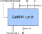

The scope of the project is to design an accelerator (e.g. a dedicated hardware circuit) for integer numbers (INT) generalized matrix-matrix multiplication. The block will be called “GeMM Unit”. This project aims to reproduce the [NVIDIA AMPERE A100 GPU](https://images.nvidia.com/aem-dam/en-zz/Solutions/data-center/nvidia-ampere-architecture-whitepaper.pdf) INT tensor core.

A GeMM is defined as:

$$
D = A \times B + C
$$

Where the multiplication operator indicates the algebraic multiplication between matrixes, while the plus operator is an element-wise addition.

The dimensions of the operands are:
A → MxK

B → KxN

C → MxN

D → MxN

Matrix sizes are decided **at design time**.
What if we want to compute matrixes that have *general* dimensions?
****For this reason, matrix C works as an accumulator of partial results for computing bigger matrixes: the computation is *tiled* in different iterations and it can take multiple steps to evaluate a certain portion of the output.
***Q1. Do you foresee how this will happen?***

### Interface

A fixed interface defines the GeMM Unit: 

- all input operands (A, B, C) can have different bandwidths. 
Matrix A and B have the same precision P, while C has a higher precision (at least 2xP). 
The total maximum bandwidth to the GeMM unit (summed over the 3 operands is 96 words (384Byte). This bandwidth can be freely divided among the operands. The scope is to make the operational efficiency as high as possible. (unused bandwidth is also OK, but not ideal).
- The same applies to the D output. D bandwidth is 32 words (128Byte).
- A valid input signal triggers the computation
- When the result is ready, the valid output is raised.

### Compute

The following scheme provides an example of the computation when A and B operands have 8-bit:

")
M, N, and K parameters are interdependent, all root from the operand precision **P,** and a 4th parameter called **T. T is also decided at design time.**
For T=32 and P=8:

K=16, M=8, N=4

***Q2. Can you derive K,M,N for T=16 and P=8?***

***Q3. What about T=32 and P=4?***

The compute of the result will be assigned to MxN different *lanes.* Each lane will evaluate a different independent element of the output matrix D.

### Assignment

1. Implement the described system with T=32 and P=8 in SystemVerilog
2. Validate and synthesize the circuit (target clock frequency will be provided later)
3. Extend the design

Extension of the design:

- Precision (we start with 8-bit and we extend to 4 and 2)
- Make also T configurable for T = [32,16,8]
- Study different circuit solutions for dotProduct
- Study different Matrix dimensions (M,N,K)
- Precision asymmetry

References:
https://docs.nvidia.com/deeplearning/performance/dl-performance-matrix-multiplication/index.html
